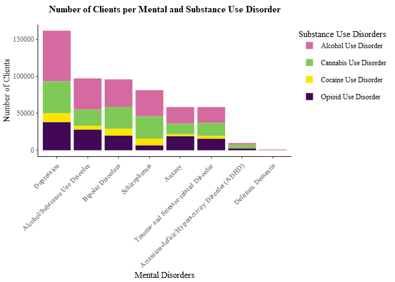
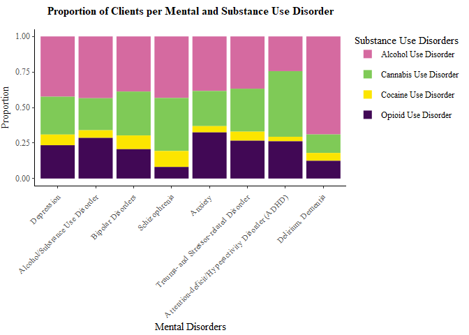
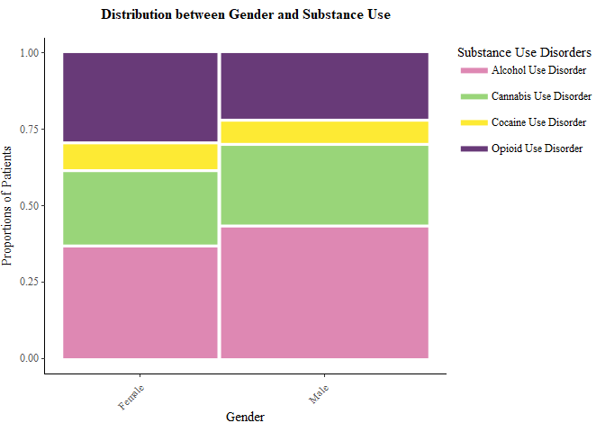
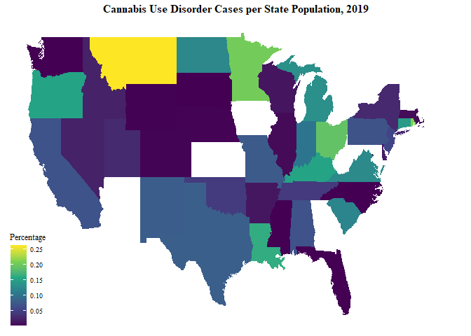

# Mental Health Diagnoses and Substance Use Characteristics of Clients in US Mental Health Treatment Facilities
###### Author: Avianna Bui & Kaylee Do 

## Note on Running the .rmd File
Due to the large data set size, I am currently unable to upload the Mental Health Dataset we use on github. To run the file, users should download the SPSS version of our data set from this link, https://www.datafiles.samhsa.gov/dataset/mental-health-client-level-data-2019-mh-cld-2019-ds0001, and save it in the same local repository as the .rmd file under the name "mhcld-2019-sav"

## Data Context 
This project draws from the Mental Health Client-Level Data (MH-CLD) in 2019 by the U.S. Department of Health and Human Services. With over 6 millions observations, this data set provides information on mental health diagnosis, treatment services, demographic of patients as well as substance use characteristics. For the specific purpose of our analysis, we only keeps a subset of variables from the original MH-CLD, including variables on mental health diagnosis and number of diagnosis, substance use, age, educational level, employment levels, living situation, race, gender and veteran status. In addition, we re-categorized the substance use disorders variable into 4 main categories: alcohol use, cocaine use, opioid use and cannabis use disorders. Within the alcohol use category, we included alcohol abuse, alcohol dependency, alcohol-related disorders and alcohol intoxication. The other three variables include disorders regarding substance use dependence and abuse.

The second data set we use is the 2019 Census US Population Data By State dataset from Kaggle. This population data derives from the 2019 US Census, collected by the US Census Bureau, along with latitude and longitude data for each states' capital city. We combine this data set with the US state variable in the Mental Health Client-Level Data to explore the percentage of clients with substance use disorders per state population.  

## Research Questions
Our research topic centers on the relationship between substance use disorders, mental health problems, and demographics within the US. More specifically, our group aims to explore whether there is a particular type of substance misuse that bears a higher correlation with a specific diagnosis of mental illness, and whether there are any trends or patterns within certain demographics or regions of those with substance use disorders

## Summary of Findings
The project suggests that depressive disorder is the most prevalent mental health disorder in US treatment facilities, followed by substance use disorder and bipolar disorder. Alcohol use disorder is the most common form of substance use disorder whereas cocaine use disorder is the least common, which can potentially be explained based on how strictly the substances are regulated. In addition, the graph also demonstrates that opioid use disorder is most commonly observed in clients with anxiety disorder at nearly one-third of the clients. 

More significantly, there is a strong trend in the distribution of subtypes of substance use disorder based on age. Specifically, the percentage of those with alcohol use disorder is higher in older age groups, with the highest group reporting alcohol use being those of 65 or older at around 68%. Meanwhile, cannabis misuse is higher in younger populations, with the highest group reporting cannabis use disorder being those between 18 and 20 (73.4%). We also found a greater proportion of reported opioid use disorder among female-identifying patients. Finally, there seems to be a greater rate of cannabis use disorder per state population in 2019 in Northeast and upper Midwest region of the US.

## Visualizations

### Question 1: Correlation of Subtypes of Substance Use Disorders and Mental Health Diagnoses

  <>

As seen within the graph, the number of clients who suffer from depression is significantly higher than that of any other group of mental health clients. For comparison, the next most popular groups (clients with alcohol and substance use disorder, schizophrenia or other psychotic disorders, and bipolar disorders) are only about two-thirds of the number of clients diagnosed with depressive disorders. Meanwhile, those with delirium or dementia were the least prevalent, which is likely to be due to the age effect, which would be further discussed.

Alcohol use disorder is the most prevalent form of substance use disorder, whereas cocaine use disorder is the least common. This is understandable considering that alcohol is the only non-illicit drug on the list, while cocaine is the most strictly regulated.

In order to better study the percentage of each substance use disorder within a mental illness diagnosis, we also adapt the previous graph into a proportional bar chart:

According to the graph, the percentage of clients with alcohol use disorder is significantly higher among those with delirium or dementia at 68%. As mentioned, alcohol use disorder is the most prevalent substance use disorder across all types of mental health problems, except for ADHD, in which cannabis use disorder is the most common at nearly 50%. Cannabis use disorder is also prevailing among clients with schizophrenia or other psychotic disorders, composing over one-third of the number of clients within the category.

On the other hand, opioid use disorder is most commonly observed in clients with anxiety at nearly one-third of the clients diagnosed with anxiety disorders. According to a study, it is estimated that 18.7% of adults with a mood or anxiety disorder received multiple prescriptions for opioids in 2016, compared to merely 5% of patients without such a diagnosis (Zagorski, 2017). Opiates are scarcely prescribed for anxiety on purpose; however, their ability to temporarily relieve anxiety often causes those with anxiety disorders to use them to counter anxiety symptoms. Unfortunately, some might overuse opioids to find alleviation from chronic anxiety.

Meanwhile, at 11%, cocaine use disorder is more prevalent in those with schizophrenia compared to those with other types of mental health problems. According to the self-medication hypothesis, schizophrenic patients “may use cocaine to counteract extrapyramidal side effects occurring as a result of antipsychotic drug treatment.” (Winklbaur et al., 2006). This might explain the higher proportion of cocaine use among those with schizophrenia.

### Question 2: Relationship Between Patients’ Demographics and Substance Use Characteristics

The following graph demonstrates the distribution of substance use disorder cases among different age groups:

 

The percentage of those with alcohol use disorder is higher in older age groups with the highest group reporting alcohol use being those of 65 or older at around 68%. Meanwhile, cannabis use is higher in younger age groups with the highest group reporting cannabis use being those between 18 and 20(73.4%). Cocaine use disorder is the lowest among the 4 categories, mainly affecting patients between the ages of 40 and 65. In the meantime, opioid use disorder is most prevalent among those between 25 and 45, with the highest age group reporting opioid use being those between 30 and 34 years old (28%).

Taking under consideration the social context surrounding substance control and substance use, it is understandable how cocaine and opioid use is much lower than alcohol and cannabis due to strict regulations and laws prohibiting the manufacturing, usage or distribution of these drugs. In terms of the contradicting trends between cannabis and alcohol use, we suspect that this is connected to the social perceptions of these substances. While both of these substances are relatively accessible, cannabis use is more common in younger patients due to its social values. For older patients, while there is research suggesting an increasing use of cannabis in groups of 65 and older, alcohol has always been more accessible to them. Given that recreational cannabis has only been legalized in certain states and municipal areas, alcohol continues to be the most accessible substance. Since alcohol use disorders are more popular among older people, it is understandable to observe a link between alcohol misuse and delirium or dementia diagnoses, which mostly happen in older adults.

We were also curious about the distribution between the different genders and substance use. The following bar graph exhibits the different in substance use characteristics between male-identifying patients and female-identifying students. We wanted to address that this data set coded and categorized patients only as male and female, without accounting for non-binary patients.

<>

This plot reveals that there are more male-identifying patients in the data set with substance use disorder compared to female patients. With that said, both cannabis and alcohol use is more prominent in male-identifying patients but opioid use is higher in female-identifying patients. Together with the previous findings of the age groups most affected by each substance, we suspect that opioid use can be partly explained by prescribed pain medications. According to reports by the National Institute for Drug Abuse, of those who began abusing opioids in the 2000s, 75 percent reported that their first opioid was a prescription drug (U.S. Department of Health and Human Services, 2022, p.3)

### Question 3: Prevalence of Cannabis Use Disorder per US State Population in 2019

-->  <--

The map demonstrates that in general, the rate of cannabis use disorder per state population in 2019 is higher in Northeast and Midwest region of the US. Meanwhile, the West and the South tend to have a lower percentage of marijuana use disorder, at around 5% to 10%. However, it is a Western state, Montana, that has the highest rate of cannabis misuse at 25%. Other states with notably high rates of cannabis use disorder are Minnesota, Ohio, and Rhode Island (approximately 20%), followed by Louisiana, Kentucky, Oregon and Connecticut at around 15%.

## Limitations
Regarding the data analysis, while a client might have multiple mental illnesses, we only account for the first mental health diagnoses in our graph. As a result, there would be disparity between the numbers displayed on the graphs and the real statistics. We also either combined multiple variables together in the case of substance use disorders, or filtered out many mental health diagnoses from the original data set, so the graphs are limited in their capability to exhibit the full picture of mental health and substance use disorders in the US.

Due to the fact that there are some states information missing from the Mental Health Client-Level Data, our map visualization of the rate of cannabis use disorder per state population remains incomplete. We hope to be be able to perform a more comprehensive analysis regarding this research question if further data is available.

In addition, since the scope of the data set is limited within the data recorded in mental health facilities in the US in 2019, it is not possible to examine the correlation between substance use disorders, mental health problems, and demographics over time or across countries. We also acknowledge the limitations of this data set in categorizing certain variables e.g. gender, which only composes of three classifications Male, Female, and Missing, without including other gender identities. As a result, we are aware that the data might facilitate biases and potential harm to marginalized communities

## Appendix
Substance Abuse and Mental Health Services Administration, Center for Behavioral Health Statistics and Quality. Mental Health Client-Level Data 2019. Rockville, MD: SAMHSA, 2022. 
https://www.datafiles.samhsa.gov/dataset/mental-health-client-level-data-2019-mh-cld-2019-ds0001

Peretz Cohen. 2019 Census US Population Data By State. Adapted from US Census Bureau, State Population Totals: 2010-2019 and US State Capital location dataset on Jasper Debie's github. 
https://www.kaggle.com/datasets/peretzcohen/2019-census-us-population-data-by-state?resource=download

Zagorski, N. (2017). Many Prescription Opioids Go to Adults With Depression, Anxiety. Psychiatric News.
https://psychnews.psychiatryonline.org/doi/10.1176/appi.pn.2017.8a13

Winklbaur, B., Ebner, N., Sachs, G., Thau, K., & Fischer, G. (2006). Substance abuse in patients with schizophrenia. Dialogues in clinical neuroscience, 8(1), 37–43.
https://doi.org/10.31887/DCNS.2006.8.1/bwinklbaur

U.S. Department of Health and Human Services. (2022, March 22). Prescription Opioids and Heroin Research Report. National Institutes of Health. Retrieved December 7, 2022. 
https://nida.nih.gov/publications/drugfacts/prescription-opioids
